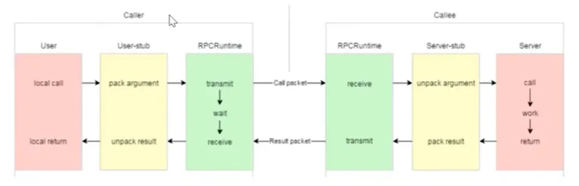
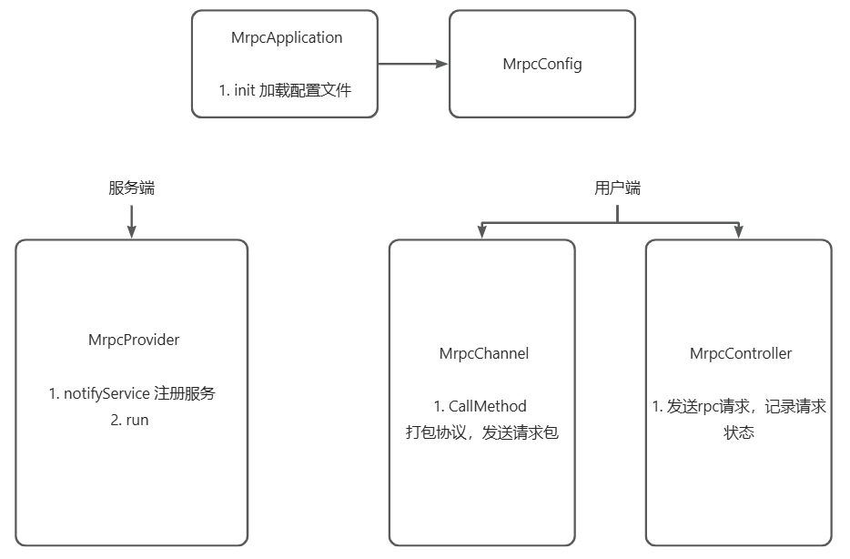

# 一个简单的RPC框架
基于protobuf和conet网络库实现的一个rpc框架，帮助理解rpc通信过程及原理

## 1. 基于protobuf
## 2. 基于conet
1. conet: https://github.com/johnsonoklii/conet

## 3. 使用
### 3.1 编译与实例
#### 3.1.1 编译
1. 前置依赖库
>1. protobuf
>2. conet
>3. zookeeper

2. 命令
```
mkdir build && cd build && cmake .. && make
``` 

2. 生成的文件
>bin: 可执行文件 \
>lib: 静态库

#### 3.1.2 实例
1. 服务端
> ./bin/provider -i conf/mrpc.conf

2. 客户端
> ./bin/consumer -i conf/mrpc.conf

### 3.2 框架使用
1. 服务端
```cpp
int main(int argc, char **argv) {
    MrpcApplication::init(argc, argv);

    MrpcProvider provider(new conet::net::EventLoop());
    provider.notifyService(new UserService()); // 注册服务
    
    provider.run(); // 启动服务
    
    return 0;
}
```
2. 客户端
```cpp
int main(int argc, char** argv) {
    MrpcApplication::init(argc, argv);

    user::UserServiceRpc_Stub stub(new MrpcChannel);
    user::LoginRequest request;
    request.set_username("zhangsan");
    request.set_password("123456");

    user::LoginResponse response;
    MrpcController controller;

    stub.Login(&controller, &request, &response, nullptr);

    if (controller.Failed()) {
        printf("stub.Login fail! error message is %s\n",controller.ErrorText().c_str());
        return -1;
    }

    if (response.rscode().code() == 0) {
        printf("rpc login success! tolen is %s\n", response.token().c_str());
    } else {
        printf("rpc login fail! error code is %d, error message is %s\n", response.rscode().code(), response.rscode().message().c_str());
    }

    return 0;
}
```

## 4. rpc通信过程
1. 红色是业务相关
2. 黄色是protobuf提供的客户端，打包、解析协议
3. 绿色是网络服务，发送、接收请求


## 4. 代码架构


### 5.1 MrpcProvider
1. notifyService：将服务注册到内部的一个map<string, ServiceInfo>，后续请求来了可以通过服务名，方法名找到对应的方法
```cpp
void MrpcProvider::notifyService(google::protobuf::Service *service) {

    ServiceInfo serviceInfo;

    // 服务描述类，包含了方法描述类
    const google::protobuf::ServiceDescriptor* pserviceDesc = service->GetDescriptor();

    std::string serviceName = pserviceDesc->name();

    int methodCount = pserviceDesc->method_count();

    for (int i = 0; i < methodCount; ++i) {
        const google::protobuf::MethodDescriptor* pmethodDesc = pserviceDesc->method(i);
        std::string methodName = pmethodDesc->name();
        serviceInfo.m_methodMap[methodName] = pmethodDesc;
    }

    serviceInfo.m_service = service;
    m_serviceMap[serviceName] = serviceInfo;
}
```

2. run: 启动conet服务器
```cpp
void MrpcProvider::run() {

    MrpcConfig config = MrpcApplication::getConfig();
    std::string ip = config.load("rpcserverip");
    int port = atoi(config.load("rpcserverport").c_str());

    conet::net::InetAddress addr(ip, port);
   
    conet::net::TcpServer server(m_loop.get(), addr, "MrpcProvider");
    server.setConnectionCallback(std::bind(&MrpcProvider::onConnection, this, std::placeholders::_1));
    server.setMessageCallback(std::bind(&MrpcProvider::onMessage, this, std::placeholders::_1,
                                                     std::placeholders::_2, std::placeholders::_3));

    server.setThreadNum(2);

    // 注册中心
    ZkClient zkClient;
    zkClient.Start();
    for (auto &service : m_serviceMap) {
        std::string serviceNode = "/" + service.first;
        zkClient.Create(serviceNode.c_str(), nullptr, 0, 0);
        for (auto &method : service.second.m_methodMap) {
            std::string methodNode = serviceNode + "/" + method.first;
            char buf[64];
            sprintf(buf, "%s:%d", ip.c_str(), port);
            zkClient.Create(methodNode.c_str(), buf, strlen(buf), ZOO_EPHEMERAL);
        }
    }

    printf("MrpcProvider start service at ip %s, port %d\n", ip.c_str(), port);

    server.start();
    m_loop->loop();
}
```

3.onMessage: 接收数据，解析协议，找到对应服务，方法，调用方法
```cpp
void MrpcProvider::onMessage(const conet::net::TcpConnection::sptr& conn, conet::net::Buffer* buffer, conet::Timestamp timestamp) {
    // 1. 读取数据
    // 2. 解析协议
    // 3. 从map<string, ServiceInfo>找到服务，方法
    google::protobuf::Service* service = it->second.m_service;          // UserService
    const google::protobuf::MethodDescriptor* method = mit->second;     // Login

    // 4. 调用方法
    google::protobuf::Message* request = service->GetRequestPrototype(method).New();  // LoginRequest
    if (!request->ParseFromString(args_str)) {
        printf("request parse error\n");
        return;
    }

    google::protobuf::Message* response = service->GetResponsePrototype(method).New();  // LoginResponse

    google::protobuf::Closure* done = google::protobuf::NewCallback<MrpcProvider
                                                                    , const conet::net::TcpConnection::sptr&
                                                                    , google::protobuf::Message*>
                                                                    (this, &MrpcProvider::sendRpcResponse, conn, response);
    // 5. 执行回调
    service->CallMethod(method, nullptr, request, response, done);
}
```

### 5.2 MrpcChannel
1. 继承RpcChannel，UserService_Stub(new MrpcChannel)，后续调用Login，会直接调用CallMethod
2. CallMethod：打包协议，发送rpc请求，接收响应
```cpp
void MrpcChannel::CallMethod(const google::protobuf::MethodDescriptor *method,
                       google::protobuf::RpcController *controller,
                       const google::protobuf::Message *request,
                       google::protobuf::Message *response,
                       google::protobuf::Closure *done) {

    // 协议： header_size(4字节) + RpcHeader(service_name, method_name, args_size) + args
    // 1. 打包协议
    // 2. 从注册中心获取服务地址
    // 3. 一个简单的客户端发送数据
    // 4. 接收响应
}
```